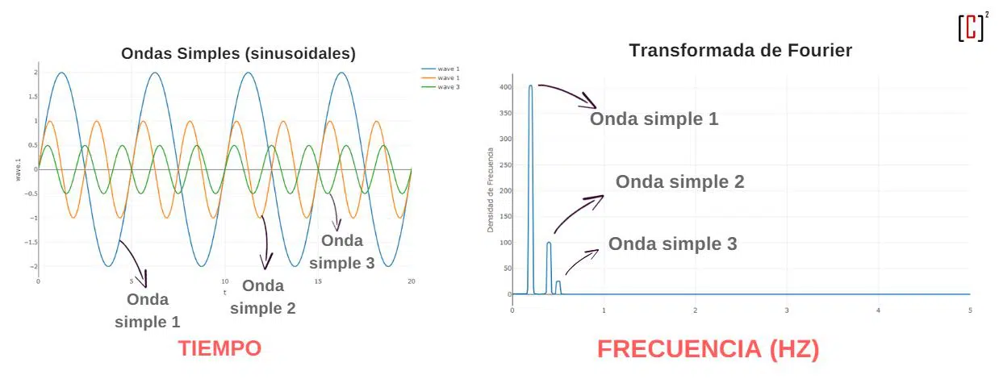

## Introduccion 2
# Contexto
Recordemos los pasos a seguir.. el mas importante son las condiciones iniciales que debemos evolucionar en el tiempo
- Principio cosmologico: Distribucion de masa es homogenea e isotropica en escalas suficientemente grande
Como se que el universo cumple el principio cosmologico? Tenemos que observar lejos, si no, no pareciera cumplirlo
Bias tracer: Diferencia entre la distribucion de bariones y materia oscura
Dipolo del CMB: Es nuestra poscion respecto al CMB, tambien se observa emision proveniente del plano galactico
                - Es muy poca la diferencia en temperatura del CMB!

# Crear un universo homogeneo e isotropico
- 
- Periodic boundary conditions: Funciona en una caja lo suficientemente grande para que no se vean afetados los bordes cuando pasen de un lado a otro. La caja se centra en el objeto mediante restas (del tamaño total de la caja)
- Estructura del universo a alto redshift (z~120): Se utiliza como base para generar condiciones iniciales que eviten el colapso masico
> Transformada de Fourier
>- Espacio de Fourier: Muy lindo y facil, frecuencia vs amplitud
> 
>- Power spectrum: que tan importante es cierta frecuencia para poder determinar la señal 

- Density contrast: Variacion del contraste de densidad. Densidad local vs densidad media del universo
> Espectro de potencia de distintos modelos cosmologicos (Power spectrum del universo):
> Hot dark matter: Mas dispersion de velocidad, menos halos de materia oscura pequeños. Cortan satelites del $10^{5}$
> Cold dark matter: menos disperson, las galaxias chiquitas sobreviven

- Evolucion temporal: 
    - Colisionless boltzmann equation: La masa de las particulas no se escapa de un pupnto de tiempo a otro en un salto temporal, ya que no hay colisiones, por ejemplo las stellar streams jejej (se observa en como se vuelve angosta o ancha dependiendo del momento de la orbita en la que se encuentre) Para extraer trayectorias y velocidades (E cinetica)
    - Ecuacion de poisson: La masa se comporta como un fluido ideal sin colisiones. Para extraer el potencial 
    - Ejemplo: Galactic dynamics pag.190 
    __La materia oscura se describe usando estas ecuaciones y la fuerza que influye en cada particula (cada fuerza$F{_i}$)__

- Softening length : Distacia de duavizado para que la integracion de la fuerza (la fuerza mencionada anterior $F_{i}$) para evitar que se destruya el sistema por la distancia entre las particulas y su posible interaccion chocadora. 

* Integracion particle-particle (PP): Demasiadas operaciones... no sirve para simulaciones de galaxias por ejemplo. 
